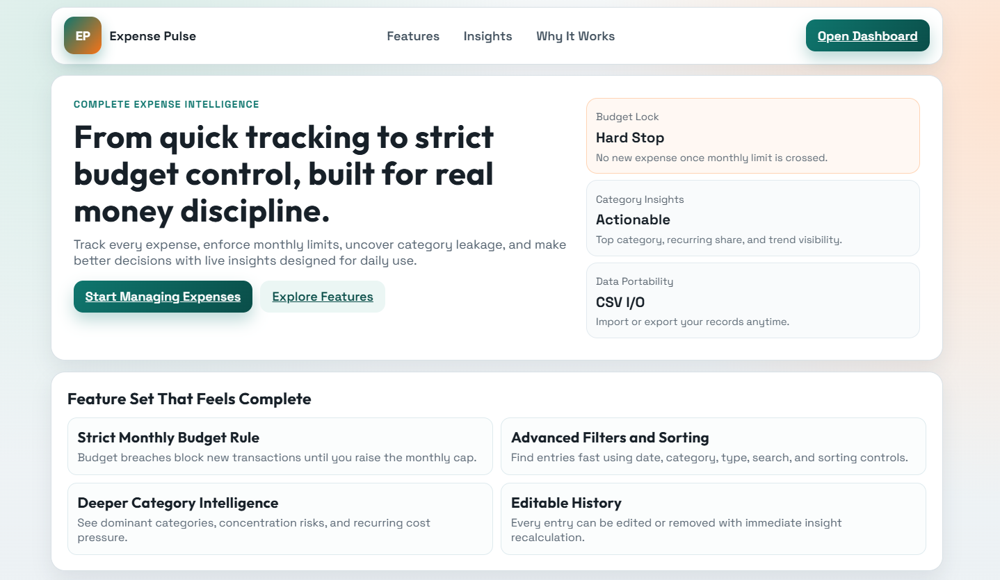
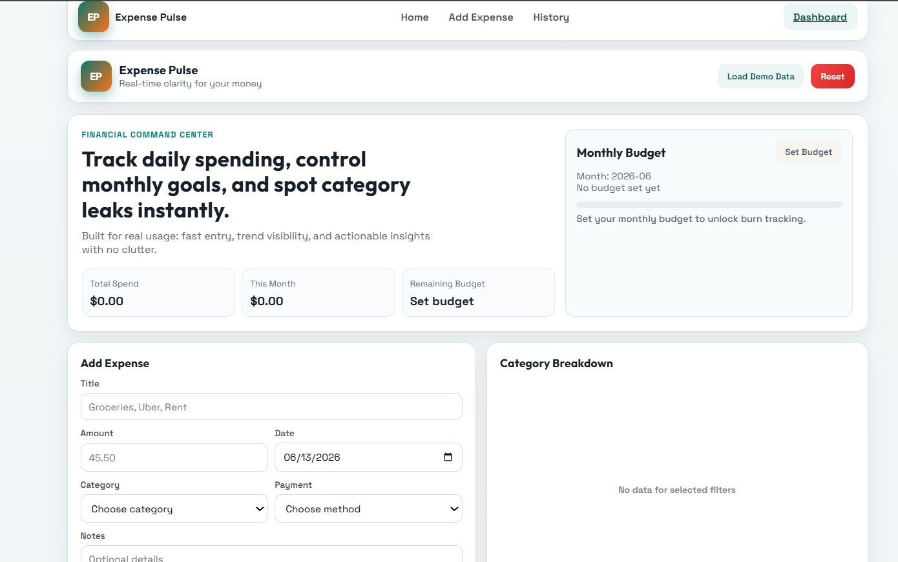
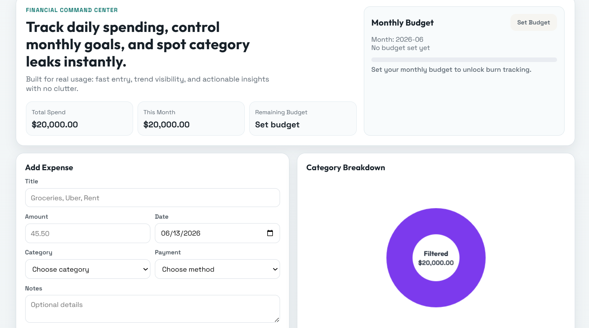
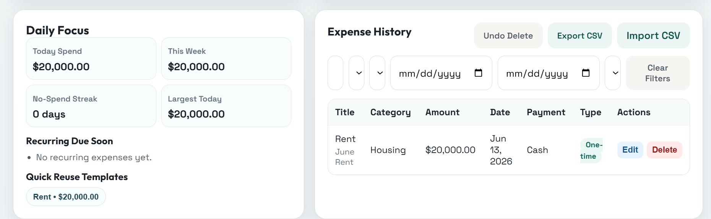

<div align="center">

# 💰 Expense Pulse

**Real-time clarity for your money.**

A full-stack expense intelligence platform with budget enforcement, category analytics, daily insights, and trend forecasting — containerized and production-ready.


</div>

---

## What It Does

Expense Pulse goes beyond basic CRUD tracking. It enforces monthly budget limits (hard lock — no new expenses once the cap is hit), breaks down spending by category with live charts, surfaces daily focus metrics like no-spend streaks and largest-today alerts, and projects month-end totals based on your actual burn rate. Built for people who want discipline, not just a ledger.

---

## Features

- **Budget Lock** — Set a monthly budget. Once crossed, the app blocks new entries until next month. No workarounds.
- **Category Breakdown** — Doughnut chart with legend showing exactly where money goes. Top category and recurring share highlighted.
- **Daily Focus Dashboard** — Today's spend, weekly total, no-spend streak, largest transaction today, and recurring expenses due soon.
- **Monthly Trend** — 6-month spending trend chart to spot patterns over time.
- **Projected Month-End** — Forecasts total monthly spend based on current daily average.
- **Smart Filtering** — Search by title/notes/payment, filter by category or type (recurring vs one-time), sort by date or amount, date range picker.
- **CSV Import/Export** — Bulk import expenses from CSV or export your full history.
- **Quick Reuse Templates** — Frequently used expenses appear as one-click templates for fast re-entry.
- **Anomaly Alerts** — Flags unusually high expenses before saving.
- **Demo Data** — One-click "Load Demo Data" button to see the app fully populated.

---

## Tech Stack

| Layer | Technology |
|-------|-----------|
| Backend | Java 17, Spring Boot, Spring MVC, Spring Data JPA |
| Security | Spring Security |
| Database | MySQL 8 |
| Frontend | Thymeleaf, Bootstrap, Chart.js |
| Containerization | Docker (multi-stage build), Docker Compose |

---

## Quick Start

The entire app runs with a single command — no Java install, no MySQL setup needed. Just Docker.

```bash
# Clone the repo
git clone https://github.com/kamalhussaindevops/expense-pulse.git
cd expense-pulse

# Start everything
docker compose up -d

# Check status
docker compose ps
```

The app will be live at **http://localhost:8080** once both containers are healthy (usually ~60 seconds for MySQL to initialize + Spring Boot to start).

To watch the startup logs:

```bash
docker compose logs -f java_app
```

Look for `Started ExpensesTrackerApplication` — that means it's ready.

### Stopping

```bash
docker compose down
```

To also wipe the database and start fresh:

```bash
docker compose down -v
```

---

## Screenshots

<div align="center">

### Landing Page


### Dashboard — Budget & Expense Entry


### Category Breakdown & Insights


### Expense History & Filters


</div>

---

## Architecture

```
┌─────────────────────────────────────────────┐
│              Docker Compose                 │
│                                             │
│  ┌───────────────┐    ┌──────────────────┐  │
│  │  Spring Boot   │    │     MySQL 8      │  │
│  │  (Java 17)     │───▶│                  │  │
│  │  Port 8080     │    │  Port 3306       │  │
│  │                │    │                  │  │
│  │  Multi-stage   │    │  Named volume    │  │
│  │  Docker build  │    │  for persistence │  │
│  └───────────────┘    └──────────────────┘  │
│                                             │
└─────────────────────────────────────────────┘
```

The Dockerfile uses a **two-stage build**: Maven compiles the JAR in stage 1, and a lightweight `eclipse-temurin:17-jre-alpine` image runs it in stage 2 — keeping the final image small and production-ready.

---

## Project Structure

```
expense-pulse/
├── src/
│   └── main/
│       ├── java/          # Spring Boot controllers, entities, repos, security
│       └── resources/
│           ├── templates/ # Thymeleaf HTML (landing + dashboard)
│           ├── static/    # CSS + JS
│           └── application.properties
├── Dockerfile             # Multi-stage build (Maven → Alpine JRE)
├── docker-compose.yml     # App + MySQL orchestration
├── sql_script.sql         # Database schema
└── pom.xml                # Maven dependencies
```

---

## License

MIT — see [LICENSE](LICENSE) for details.
